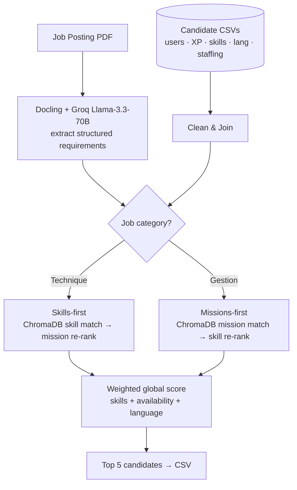

# StaffBot — Candidate-to-Job Matching

> Hackathon project (HEC Montréal): given a job-posting PDF and a roster of candidate CSVs, return the top 5 candidates using LLM-extracted requirements, semantic skill/mission matching, and a weighted multi-criteria score.

## 🎯 Objective

Recruiters spend hours scanning candidate spreadsheets to fill a single posting. StaffBot automates the first-pass shortlist: it reads a job posting (PDF), pulls structured requirements out of it with an LLM, embeds candidate skills and past missions, and ranks the roster against the posting along four axes — semantic skill match, semantic mission match, availability, and language fit.

The most interesting design choice: the matching pipeline **branches on the role type**. Technical roles weight skills heavily and search skills first; management roles do the inverse on missions. This decision is made automatically from the LLM's classification of the posting.

## 🏗️ Architecture

*Job posting is parsed by an LLM; candidate CSVs are joined and embedded; the matching order branches on whether the role is technique (skills-first) or gestion (missions-first); a weighted global score selects the top 5.*



## 🛠️ Tech Stack

- **PDF parsing**: [Docling](https://github.com/docling-project/docling) (`convert_pdf_to_markdown`)
- **LLM**: [Groq](https://groq.com) running `llama-3.3-70b-versatile` for JSON extraction
- **Vector store**: [ChromaDB](https://www.trychroma.com) (in-memory)
- **French NLP**: [spaCy](https://spacy.io) `fr_core_news_sm` for lemmatization, [NLTK](https://www.nltk.org) for sentence tokenization
- **Embeddings**: [SentenceTransformer](https://www.sbert.net) `all-MiniLM-L6-v2`
- **UI / orchestration**: Streamlit
- **Data**: pandas

## 📊 What it does

For each posting, the pipeline produces three component scores plus a weighted global score (all on a 0–100 scale):

| Component | What it measures | How it's computed |
|---|---|---|
| `SCORE_SKILLS_MISSIONS` | Semantic match between posting and candidate | ChromaDB queries on top 1/6 of skills, then top 10% by `LEVEL_VAL`; combined with mission embeddings |
| `SCORE_DISPO` | Availability | Compared against the mandate duration extracted from the posting |
| `SCORE_LANGUAGE` | Language fit | Score on the languages the posting requires |
| `SCORE_GLOBALE` | Weighted final | **Technique:** skills 0.80 / dispo 0.10 / lang 0.10 — **Gestion:** 0.60 / 0.25 / 0.15 |

The internal mission/skill re-ranking is also weighted differently per role type (technique: 0.9 skills / 0.1 missions; gestion: 0.1 / 0.9).

## 📁 Repository Structure

```
StaffBot/
├── main.py                          # Streamlit UI + pipeline orchestrator (12 steps)
├── extract_data.py                  # PDF → Markdown via Docling
├── llm.py                           # Groq Llama-3.3-70B → JSON requirements
├── csv_to_dataframe.py              # Loads HCK_HEC_*.csv files
├── clean_dataframes.py              # Deduplicates and joins user/XP/skills/lang/staffing
├── semantic_search_skills.py        # ChromaDB skill match (top 1/6, then top 10% by level)
├── preprocess_missions.py           # FR lowercase → NLTK sent-tokenize → spaCy lemma → MiniLM-L6
├── semantic_search_missions.py      # Embedding-similarity mission match
├── ranking_skills_missions.py       # Branch-aware re-ranking
├── compute_disponilite.py           # Availability score
├── language_score.py                # Language match score
├── compute_global_score.py          # Weighted aggregation + top-N
└── READ ME/StaffBot_flowchart.jpg   # Original French flowchart (kept for history)
```

## 🚀 How to Run

```bash
pip install -r requirements.txt
python -m spacy download fr_core_news_sm
```

Set up a `.env` file:

```
GROQ_API_Token=your_groq_api_key
```

Drop `<Poste>.pdf` (e.g. `Data Analyst.pdf`, `Scrum.pdf`) and the five `HCK_HEC_*.csv` files at the project root, then:

```bash
streamlit run main.py
```

Pick a posting from the dropdown; results are written to `<Poste>_top5_candidats.csv`.

## 📝 Notes / Limitations

- **Hackathon scope.** Built under time pressure for a HEC Montréal hackathon (`HCK_HEC_*` CSV naming). It is a working prototype, not a production matching system.
- **Hackathon dataset is private.** The `HCK_HEC_*.csv` files (users, XP, skills, languages, staffing) are not committed. The pipeline runs locally only if you have those files plus `<Poste>.pdf`.
- **Mixed French/English codebase.** Variable names and the Streamlit UI are in French (`catégorie_poste`, `dispo`, `Étape 1/12: ...`). Module-level docstrings are mixed. Filename `compute_disponilite.py` is a typo for `disponibilité`.
- **Role classification is regex on a single LLM field.** `catégorie_poste` is matched against `\b\w*\s*techn?iqu[e]s?\b` and `\b\w*\s*gestion\b`. Robust enough for the hackathon, brittle for new role categories.
- **In-memory ChromaDB.** The skills collection is rebuilt every run; no persistence and no caching of embeddings between Streamlit reruns.
- **Top-N is hardcoded.** Always returns 5; cutoff is not configurable in the UI.
- **No quantitative evaluation committed.** No ground-truth labels or held-out test set — outputs were judged qualitatively during the hackathon.
